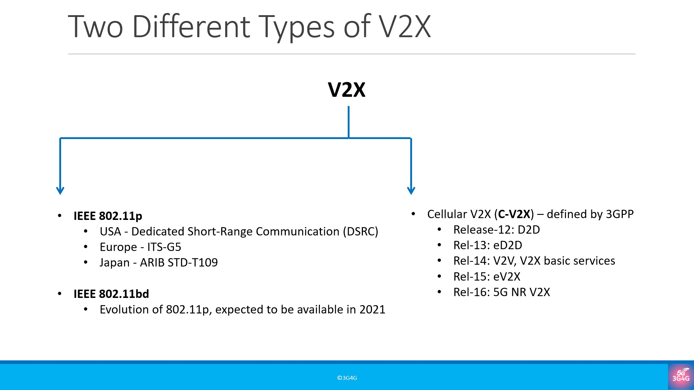

# Vehicle to Everything (V2X)

Vehicle to Everything (V2X) covers everything from Vehicle to Vehicle (V2V), Vehicle to Infrastructure (V2I), Vehicle to Network (V2N), Vehicle to Pedestrian (V2P) and even Pedestrian to Network (P2N)

https://www.qualcomm.com/media/documents/files/introduction-to-c-v2x.pdf
https://www.qualcomm.com/media/documents/files/introduction-to-c-v2x.pdf
https://5gaa.org/wp-content/uploads/2021/06/5GAA_S-210019_Position-paper-on-European-deployment-band-configuration-for-C-V2X_final.pdf
https://corporatefinanceinstitute.com/resources/knowledge/other/vehicle-to-everything-v2x/
https://5gaa.org/wp-content/uploads/2019/01/5GAA_White-Paper-CV2X-Roadmap.pdf
https://www.qualcomm.com/news/onq/2020/10/30/future-now-c-v2x-needs-immediate-access-59-ghz-spectrum-us-improve-roadway
https://archive.eetasia.com/www.eetasia.com/ART_8800721484_499488_TA_be40e88d_4.HTM
https://www.synopsys.com/designware-ip/technical-bulletin/adoption-5g-automotive-applications.html
https://www.greyb.com/v2x-companies/
https://5gaa.org/news/timeline-for-deployment-of-lte-v2x/
http://www.researchinchina.com/Report/ReportInfo.aspx?id=11650
https://blog.3g4g.co.uk/2018/09/5g-new-radio-standards-and-other.html
https://blog.3g4g.co.uk/search/label/V2X
https://5g.security/5g-technology/5g-3gpp-releases-15-16-17/
https://assets.new.siemens.com/siemens/assets/api/uuid:ab5935c545ee430a94910921b8ec75f3c17bab6c/its-g5-ready-to-roll-en.pdf
https://iot4beginners.com/vehicle-to-everything-v2x/
https://www.qualcomm.com/news/onq/2018/06/14/live-san-diego-3gpp-sets-out-expand-5g-new-industries-video
https://www.3gpp.org/release-14
https://portal.3gpp.org/desktopmodules/Specifications/SpecificationDetails.aspx?specificationId=3179

https://www.researchgate.net/figure/C-V2X-standardization-and-evaluation_fig1_342624384
https://www.semanticscholar.org/paper/Vehicle-to-Everything-(v2x)-Services-Supported-by-Chen-Hu/3ed2265e1f5854306ebd2ed85159c4e23b8f1eb2/figure/3
https://www.rcrwireless.com/20180604/5g/what-is-next-for-5g-after-completing-the-first-3gpp-standard
https://eu.mouser.com/blog/eit-5g-2021-6-key-aspects-3gpp-5-release-16
https://vtsociety.org/2018/02/vehicles-february-2018/
https://blog.3g4g.co.uk/search/label/V2X
