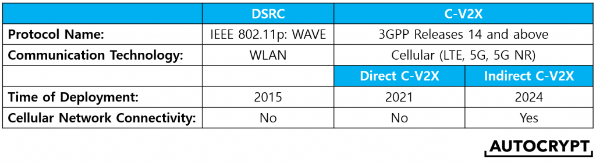

# Vehicle to Everything (V2X) 

V2X (vehicle-to-everything) is an umbrella term that is used to refer to a vehicle’s communication with all other entities, including other moving and parked vehicles, pedestrians, traffic signals, road signs, construction sites, and many more. A vehicle communicates with the outside world in two ways:    

- by receiving physical feedback from the lidar sensors equipped around the vehicle.

- by wireless communication that sends and receives messages to and from other entities. 

These two methods complement each other to complete the autonomous driving experience. For example, lidar sensors provide feedback from the surrounding environment to detect any immediate threats, while messages regarding every vehicle’s location, speed, and direction from as far as 300 meters can be obtained through wireless communication so that the car can adjust its behaviors far ahead of time.

Lidar sensors provide one-way communication, in which the car receives information from its surroundings by physically illuminating them with laser light. By contrast, wireless communication technology enables two-way communication, so that the vehicle not only receives information, but also sends messages regarding its behavior to all other certified entities. Today, the term “V2X” is mostly used to refer to the latter – wireless vehicular communications.

V2X technology significantly increases a vehicle’s autonomy. For instance, by communicating with traffic signals, the car receives real-time information about when to stop at intersections. By communicating with the pedestrians’ mobile devices, the car can stay ahead of itself to prepare to stop for jaywalkers. By communicating with construction and accident sites, the car can look for the nearest detour to avoid getting trapped in traffic jams.

Note that V2X must be complemented by lidar sensors because even though it provides perfectly accurate information, it is not capable of detecting entities that are not equipped with communication technology, such as an old conventional car or a rock on the road. Thus, the importance of cameras and sensors must not be neglected.

In this post, we will take a deeper look at the two different V2X wireless communication technologies currently used by automakers and infrastructure developers across the globe. [source](https://autocrypt.io/dsrc-vs-c-v2x-a-detailed-comparison-of-the-2-types-of-v2x-technologies/)

[source](https://www.3g4g.co.uk/V2X/)

#### DSRC (defined by IEEE 802.11p: WAVE)

DSRC was first introduced as a V2X technology in the Institute of Electrical and Electronics Engineers ([IEEE](https://www.ieee.org/))’s [802.11p](https://standards.ieee.org/standard/802_11p-2010.html) standard, a vehicular communication protocol intended for adding wireless access in vehicular environments (WAVE). As the first communication standard for V2X, WAVE uses WLAN technology to establish dedicated short-range communication (DSRC) channels so that the vehicles can communicate directly to other entities within short to medium ranges (typically 300 meters). Despite WAVE being the official name of the protocol, many still refer to the technology as DSRC to describe the underlying mechanism. In fact, many industry experts would use the terms **DSRC, 802.11p, WAVE**, or **WLAN-based V2X** interchangeably to refer to the same thing.

DSRC is essentially a modification of Wi-Fi. The technology was considered a huge breakthrough in the automotive industry because it allows for data to be transmitted between two devices without going through any intermediaries, making it highly useful for rural and remote areas without any telecommunication infrastructure. This is like sending a text message to another phone 300 meters away without the need for cellular network coverage. Moreover, DSRC is known for having very low latency due to the elimination of the intermediary.

After its initial approval in 2010, DSRC went through years of testing before it was first deployed in selected Toyota vehicles manufactured in Japan in 2015, and later adopted by some Cadillac models in the US in 2017. In 2019, the Volkswagen Golf 8, one of the most popular cars in Europe, became the most sold V2X-enabled car in the market.

Dedicated Short Range Communication (DSRC) is an 802.11p-based wireless communication technology that enables highly secure, high-speed direct communication between vehicles and the surrounding infrastructure, without involving any cellular infrastructure. IEEE 802.11p is an amendment to the IEEE 802.11 standard that defines enhancements to support Intelligent Transportation Systems (ITS) applications. [source](https://www.everythingrf.com/community/what-is-dsrc)

**DSRC** operates in the 5.9 GHz band providing direct, low latency information exchange between vehicles and the infrastructure. In 2004, the FCC dedicated a bandwidth of 75 MHz for DSRC technology in the 5.9 GHz band.

DSRC provides a highly secure communication channel. The receiving vehicle validates the authenticity of the received messages and the messages aren’t linkable to the vehicle, thus protecting the driver's privacy. Every vehicle broadcasts its location, heading and speed 10 times per second in a secure and anonymous manner. All surrounding vehicles receive the message, and each estimates the risk imposed by the transmitting vehicle. This allows a perception, detection and assessment of dangerous situations (road obstacles and potential collisions with road users) even before they can be noticed visually.

**Dedicated Short Range Communications have two operating modes:**

- Vehicle-to-Vehicle (V2V)
- Vehicle-to-Infrastructure (V2I)

DSRC can provide high-speed communication even in the presence of obstructions and can even handle fast-changing environment at speeds as high as 500 km/h. It is optimized to “see around corners” (Non-Line-Of-Sight) and operate in extreme weather conditions.

#### C-V2X (defined by 3GPP Releases 14, 15, 16)

Introduced soon after DSRC, C-V2X is another vehicular communication protocol developed for V2X. Defined by the 3rd Generation Partnership Projects (3GPP), C-V2X utilizes cellular radio instead of WLAN, meaning that it utilizes the same set of cellular radio technology as cellphones do. The major difference that sets C-V2X apart from DSRC is that it allows both direct and indirect communication. In **direct C-V2X**, vehicles communicate directly with other vehicles (V2V) and roadside units (V2I) the same way as how DSRC works. Under indirect C-V2X, vehicles communicate with other entities indirectly via the cellular network (V2N), which is something DSRC cannot do.

**Indirect C-V2X** is useful because the cellular network can collect data from many cars, and thus can be more effective at managing traffic on a larger scale. Originally designed in Release 14 to use the LTE standard, 3GPP later added compatibility for 5G and 5G NR in Releases 15 and 16.

Even though DSRC had been gaining ground in Japan and Europe, C-V2X is becoming increasingly popular in the US, China, and other regions of the world. Furthermore, C-V2X has won support from many professional organizations such as the 5G Automotive Association (5GAA) based on its advantages to DSRC. Then, what are some of the pros and cons of C-V2X when compared to DSRC?

On the pros, supporters of C-V2X generally suggest that cellular radio technology has better growth potential for faster speeds and higher reliability. This means that looking at the long-run, C-V2X is more sustainable as it offers a long-term path for constant improvements. Moreover, the ability to connect to the cellular network could create a much smarter transportation system. Lastly, the price of cellular chipsets is cheaper than that of WLAN chipsets.

On a side note, some uncontrolled experiments show that direct C-V2X offers greater range than DSRC. But this is not scientifically proven, and that the 300-meter range of DSRC is more than enough for autonomous driving purposes.

As for the cons, supporters of DSRC believe that switching to C-V2X would delay the rollout of autonomous driving because DSRC is a more mature standard, proven to work in large commercial settings. C-V2X is still undergoing its final testing stage when it comes to large-scale deployment, and indirect C-V2X does not look like it will be ready for commercialization until at least 2024, though direct C-V2X is on schedule for commercial deployment in 2021.

#### DSRC and C-V2X Compatibility

At the end of the day, both DSRC and C-V2X have the same use cases, meaning that the real-life application is the same across both standards. Despite all the rhetoric from both sides, there had been no side-by-side testing proving that one performs better than the other in application.

Due to a lack of statistical evidence on the performance side, the industry has slowly shifted to prefer C-V2X as it exhibits better long-term prospects. The problem is that because DSRC and C-V2X run on different communication technologies, the access layer is not interoperable. Automakers and infrastructure developers face the difficult choice of adopting one or the other in their infrastructures.

The good news for automakers is that many chipmakers have started manufacturing dual-mode chipsets that are compatible with both standards, helping those undergoing the transition.

In terms of infrastructure developers, many of those with existing DSRC infrastructures are now working to add cellular network connectivity to them by combining them with indirect C-V2X. [source](https://autocrypt.io/dsrc-vs-c-v2x-a-detailed-comparison-of-the-2-types-of-v2x-technologies/)

https://www.toyo.co.jp/files/user/img/seminar/ict/spirent_NA/Final_Spirent_V2X_Solutions_TOKYO_2018.pdf

https://www.nxp.com/docs/en/supporting-information/CHOOSING-RIGHT-V2X-TECHNOLOGY.pdf

https://min.news/zh-cn/hot/08df670a66fd49558cf3dbccde998b99.html

https://www.ednchina.com/news/20171018V2X.html

https://www.nxp.com/docs/en/supporting-information/CHOOSING-RIGHT-V2X-TECHNOLOGY.pdf

https://blog.3g4g.co.uk/search/label/V2X

https://www.drivesection.com/tech/vehicle-to-everything-explained/

https://www.3g4g.co.uk/V2X/

https://autocrypt.io/infographic-7-v2x-application-scenarios/

https://autocrypt.io/dsrc-vs-c-v2x-a-detailed-comparison-of-the-2-types-of-v2x-technologies/

https://www.qualcomm.com/media/documents/files/introduction-to-c-v2x.pdf
https://www.qualcomm.com/media/documents/files/introduction-to-c-v2x.pdf
https://5gaa.org/wp-content/uploads/2021/06/5GAA_S-210019_Position-paper-on-European-deployment-band-configuration-for-C-V2X_final.pdf
https://corporatefinanceinstitute.com/resources/knowledge/other/vehicle-to-everything-v2x/
https://5gaa.org/wp-content/uploads/2019/01/5GAA_White-Paper-CV2X-Roadmap.pdf
https://www.qualcomm.com/news/onq/2020/10/30/future-now-c-v2x-needs-immediate-access-59-ghz-spectrum-us-improve-roadway
https://archive.eetasia.com/www.eetasia.com/ART_8800721484_499488_TA_be40e88d_4.HTM
https://www.synopsys.com/designware-ip/technical-bulletin/adoption-5g-automotive-applications.html
https://www.greyb.com/v2x-companies/
https://5gaa.org/news/timeline-for-deployment-of-lte-v2x/
http://www.researchinchina.com/Report/ReportInfo.aspx?id=11650
https://blog.3g4g.co.uk/2018/09/5g-new-radio-standards-and-other.html
https://blog.3g4g.co.uk/search/label/V2X
https://5g.security/5g-technology/5g-3gpp-releases-15-16-17/
https://assets.new.siemens.com/siemens/assets/api/uuid:ab5935c545ee430a94910921b8ec75f3c17bab6c/its-g5-ready-to-roll-en.pdf
https://iot4beginners.com/vehicle-to-everything-v2x/
https://www.qualcomm.com/news/onq/2018/06/14/live-san-diego-3gpp-sets-out-expand-5g-new-industries-video
https://www.3gpp.org/release-14
https://portal.3gpp.org/desktopmodules/Specifications/SpecificationDetails.aspx?specificationId=3179

https://www.researchgate.net/figure/C-V2X-standardization-and-evaluation_fig1_342624384
https://www.semanticscholar.org/paper/Vehicle-to-Everything-(v2x)-Services-Supported-by-Chen-Hu/3ed2265e1f5854306ebd2ed85159c4e23b8f1eb2/figure/3
https://www.rcrwireless.com/20180604/5g/what-is-next-for-5g-after-completing-the-first-3gpp-standard
https://eu.mouser.com/blog/eit-5g-2021-6-key-aspects-3gpp-5-release-16
https://vtsociety.org/2018/02/vehicles-february-2018/
https://blog.3g4g.co.uk/search/label/V2X

https://auto-talks.com/dsrc-vs-c-v2x/
